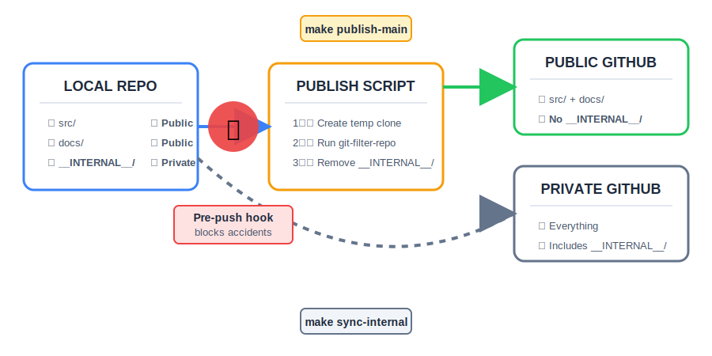

<h1 align="center" margin-bottom="50px">🔐 Track-Ignored-Stuff</h1>

<div align="center" margin-top="20px">


## **Version control for your private files in public repositories**

### *Work freely with internal docs • Push safely to public repos • Never leak sensitive content*

---

</div>

## 🎯 The Problem

You're building an **open source project** on GitHub, but you have files you want to keep private:

```
my-awesome-project/
├── src/                    ✅ Public code
├── docs/                   ✅ Public docs
└── __INTERNAL__/           
    ├── notes.md            ⚠️ Private notes, planning documents,
    ├── AGENTS.md           ⚠️ maybe just something you're
    └── embarrassing-ideas/ ⚠️ a little embarassed about!
```

**The Dilemma:**
- 🚫 `.gitignore` them → You lose version control
- 🚫 Commit them → They appear in your public GitHub history
- ✅ **Track-Ignored-Stuff** → Version controlled locally, never published to GitHub

---

## 🎬 How It Works



---

## ✨ Key Features

<table>
<tr>
<td width="50%" valign="top">

### 🛡️ **Safety First**
- Pre-push hook prevents accidental leaks
- Blocks pushes to public remotes
- Configurable remote whitelist

</td>
<td width="50%" valign="top">

### 🧹 **Clean History**
- Uses `git-filter-repo` for complete removal
- No trace of internal files in public repo
- Fresh, clean commits every time

</td>
</tr>
<tr>
<td width="50%" valign="top">

### 🔄 **Dual Remotes**
- Public remote: cleaned, safe code
- Private remote: full history (optional)
- Subtree support for syncing internal docs

</td>
<td width="50%" valign="top">

### ⚡ **Simple Workflow**
- Work locally as normal
- One command to publish safely
- Makefile automation included

</td>
</tr>
</table>

---

## 🚀 Quick Start

### Prerequisites (one dependency)

```bash
# Install git-filter-repo
pip install git-filter-repo

# Or via package manager
brew install git-filter-repo  # macOS
apt install git-filter-repo   # Ubuntu/Debian
```

### Setup (30 seconds)

```bash
# 1️⃣ Run the `simple-setup.sh` script (downloads `.githooks/`, `scripts/`, and `Makefile`)
curl -fsSL https://raw.githubusercontent.com/hesreallyhim/track-ignored-stuff/main/simple-setup.sh | bash

# 2️⃣ Install the pre-push hook
make init

# 3️⃣ Configure your remotes
git remote add origin-public git@github.com:username/public-repo.git
git remote add origin-internal git@github.com:username/private-repo.git  # optional

# 4️⃣ Create your internal directory
mkdir __INTERNAL__
echo "# My secret notes" > __INTERNAL__/notes.md
git add __INTERNAL__/
git commit -m "Add internal docs"
```

### Daily Workflow

```bash
# Work normally with all files
vim src/main.py
vim __INTERNAL__/planning.md
git add .
git commit -m "Add feature X"

# When ready to publish to public GitHub
make publish-main
# Everything gets pushed up - but all trace of your `__INTERNAL__` docs is expunged

# (Optional) Sync internal docs to private repo (supports collaboration)
make sync-internal
```

---

## 📋 Commands Reference

<div align="center">

| Command | Description | What it does |
|---------|-------------|--------------|
| `make init` | **Setup** | Installs pre-push hook to protect against accidents |
| `make publish-main` | **Publish** | Cleans & pushes `main` branch to public remote |
| `make publish-branches BRANCHES="main dev"` | **Multi-branch** | Publish multiple branches at once |
| `make sync-internal` | **Sync private** | Push `__INTERNAL__/` to private remote using subtree |
| `make clean` | **Cleanup** | Remove temporary directories |

</div>

---

## 🔧 Configuration

### Custom Internal Directory

Edit `scripts/publish.sh`:
```bash
INTERNAL_DIR="my-private-stuff"  # default: __INTERNAL__
```

### Custom Remote Pattern

Edit `.githooks/pre-push`:
```bash
ALLOW_REMOTES_REGEX="^origin-internal$|^backup-"  # Allow multiple patterns
```

### Publish Specific Branches

```bash
# Publish single branch
PUBLIC_BRANCHES="release/v2" make publish

# Publish multiple branches
PUBLIC_BRANCHES="main develop release/v1" make publish
```

---

## 🎓 How It Works (Deep Dive)

### 1. Pre-Push Hook 🛡️

Installed in `.git/hooks/pre-push`, this hook:
- Intercepts all `git push` commands
- Checks if you're pushing to a public remote
- Blocks the push if `__INTERNAL__/` exists in the branch
- Only allows pushes to remotes matching `ALLOW_REMOTES_REGEX`

```bash
# Example: trying to push to public remote
git push origin-public main
# ❌ Blocked! Use 'make publish-main' instead
```

### 2. Publish Script 🧹

The `scripts/publish.sh` script does the heavy lifting:

1. **Creates temporary clone** → `/tmp/repo-publish-<random>/`
2. **Runs git-filter-repo** → Removes all `__INTERNAL__/` from history
3. **Checks out branch** → e.g., `main`
4. **Force pushes to public** → `origin-public`
5. **Cleans up** → Removes temporary directory

```bash
# What happens under the hood
git clone . /tmp/repo-publish-abc123
cd /tmp/repo-publish-abc123
git-filter-repo --path __INTERNAL__ --invert-paths --force
git push --force origin-public main
```

### 3. Subtree Sync (Optional) 🌳

For syncing `__INTERNAL__/` to a separate private repo:

```bash
# First time setup
git subtree split --prefix=__INTERNAL__ -b internal-branch
git push origin-internal internal-branch:main

# Subsequent syncs
make sync-internal
```

---

## ⚠️ Important Notes

- **Backup first**: Test this workflow on a non-critical project first
- **Force push warning**: The publish script uses `--force` to rewrite history
- **Not a submodule**: `__INTERNAL__/` must be a regular directory, not a Git submodule
- **git-filter-repo**: Must be installed (officially recommended tool by [git docs](https://git-scm.com/docs/git-filter-branch#_warning))
- **One-way sync**: Changes in public remote won't sync back to internal files

---

## 🔒 Security Considerations

### What This Protects Against
✅ Accidental `git push` of internal files  
✅ Internal files appearing in public commit history  
✅ Leaking sensitive data to public repositories  

### What This Does NOT Protect Against
❌ Files already pushed before setup (see cleanup below)  
❌ Local repository compromise  
❌ Intentional bypass of the hook (e.g., `git push --no-verify`)  

### Cleaning Existing History

If you've already pushed `__INTERNAL__/` to your public repo:

```bash
# ⚠️ WARNING: This rewrites history and breaks clones!

# 1. Backup your repo
git clone your-repo your-repo-backup

# 2. Remove internal files from all history
git filter-repo --path __INTERNAL__ --invert-paths --force

# 3. Force push to public remote (coordinate with team!)
git push origin --force --all
git push origin --force --tags
```

---

## 🤔 FAQ

<details>
<summary><b>Why not just use <code>.gitignore</code>?</b></summary>

`.gitignore` prevents files from being *staged*, but you lose version control. This solution lets you version control internal files locally while keeping them out of public repos, and avoids alternative solutions (submodules, symlinks, etc.) which may confuse you, your IDE, or your coding assistant - all complexity is abstracted away into a few easily configurable scripts.

</details>

<details>
<summary><b>Can I use multiple internal directories?</b></summary>

Yes! Edit `INTERNAL_DIR` in the scripts to support patterns, or run filter-repo multiple times with different paths.

</details>

<details>
<summary><b>What if I forget and push directly?</b></summary>

You can't. The pre-push hook will block it. (If you bypass with `--no-verify`, you'll need to force-push a cleaned version to fix it.)

</details>

<details>
<summary><b>Does this work with GitHub Actions?</b></summary>

Yes! You can automate the publish script in CI/CD. Just ensure `git-filter-repo` is installed in the runner.

</details>

<details>
<summary><b>Does this work with git worktrees?</b></summary>

Yes! Create separate worktrees for main, feature branches, or private development:

```bash
git worktree add ../proj-main main
git worktree add ../proj-dev dev-internal
```

Only one worktree should be used to publish:

```bash
cd ../proj-main
make publish-main
```

</details>

<details>
<summary><b>Performance with large repos?</b></summary>

`git-filter-repo` is fast, but creating temporary clones takes time. For very large repos, consider using shallow clones or selective branch publishing.

</details>

---

## 🛠️ Troubleshooting

### Hook not working?

```bash
# Check if hook is executable
ls -la .git/hooks/pre-push

# Make it executable
chmod +x .git/hooks/pre-push

# Verify hook is installed
cat .git/hooks/pre-push
```

### `git-filter-repo` not found?

```bash
# Verify installation
which git-filter-repo

# Install via pip
pip install git-filter-repo

# Or download directly
wget https://raw.githubusercontent.com/newren/git-filter-repo/main/git-filter-repo
chmod +x git-filter-repo
sudo mv git-filter-repo /usr/local/bin/
```

### Publish fails with "ref already exists"?

```bash
# The script uses --force, but if you need to manually fix:
cd /tmp/repo-publish-*/
git push origin-public main --force
```

---

## 📚 Additional Resources

- [git-filter-repo Documentation](https://github.com/newren/git-filter-repo/)
- [Git Subtree Tutorial](https://www.atlassian.com/git/tutorials/git-subtree)
- [Git Hooks Guide](https://git-scm.com/book/en/v2/Customizing-Git-Git-Hooks)

---

## 🤝 Contributing

Contributions welcome! Here's how:

1. Fork the repository
2. Create a feature branch: `git checkout -b feature/amazing-idea`
3. Make your changes
4. Test thoroughly
5. Submit a pull request

Please open an issue first to discuss major changes.

---

## 📜 License

MIT License - see [LICENSE](LICENSE) file for details.

---

## 🙏 Acknowledgments

- Thanks to [newren](https://github.com/newren) for the amazing `git-filter-repo` tool
- Inspired by various discussions about managing private files in public repos
- Built out of necessity and a healthy dose of paranoia

---

<div align="center">

**⭐ Star this repo if you find it useful!**

Made with ❤️ and a healthy dose of privacy

[Report Bug](https://github.com/hesreallyhim/track-ignored-stuff/issues) • [Request Feature](https://github.com/hesreallyhim/track-ignored-stuff/issues)

</div>
